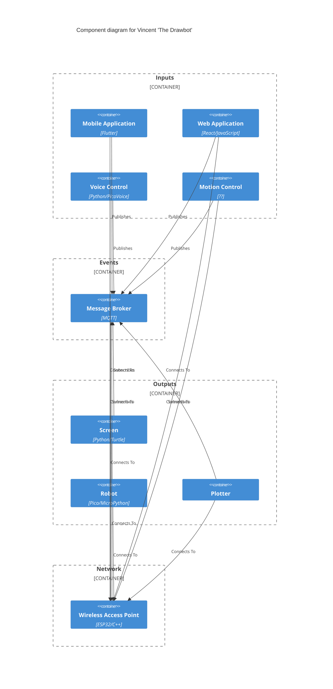

```mermaid

C4Component
title Component diagram for Vincent 'The Drawbot'


Container_Boundary(inputs, "Inputs") {
    Container(mobile, "Mobile Application", "Flutter", "")
    Container(web, "Web Application", "React/JavaScript", "")
    Container(voice, "Voice Control", "Python/PicoVoice", "")
    Container(motion, "Motion Control", "??", "")

    Rel(mobile, broker, "Publishes", "")
    Rel(web, broker, "Publishes", "")
    Rel(voice, broker, "Publishes", "")
    Rel(motion, broker, "Publishes", "")
}


Container_Boundary(events, "Events") {
    Container(broker, "Message Broker", "MQTT ", "")
}

Container_Boundary(outputs, "Outputs") {
    Container(screen, "Screen", "Python/Turtle", "")
    Container(robot, "Robot", "Pico/MicroPython", "")
    Container(plotter, "Plotter", "", "")
    Rel(screen, broker, "Subscribes", "")
    Rel(robot, broker, "Subscribes", "")
    Rel(plotter, broker, "Subscribes", "")
}

Container_Boundary(network, "Network") {
    Container(ap, "Wireless Access Point", "ESP32/C++", "")
    Rel(screen, ap, "Connects To", "")
    Rel(robot, ap, "Connects To", "")
    Rel(plotter, ap, "Connects To", "")
    Rel(broker, ap, "Connects To", "")
    Rel(mobile, ap, "Connects To", "")
    Rel(web, ap, "Connects To", "")
    Rel(voice, ap, "Connects To", "")
    Rel(motion, ap, "Connects To", "")
}


UpdateLayoutConfig($c4ShapeInRow="4", $c4BoundaryInRow="1")

```
